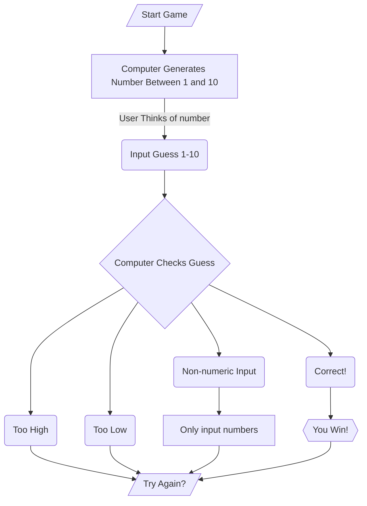

# Step by Step
###### Ooh baby!
1. Created the prompt to begin the game.
2. Game started, computer generates a random number.
3. Player thinks of number and then inputs it into the game.
4. Computer checks if the answer is correct, incorrect, or if it is an unacceptable value.
5. If correct, the game tells you you win, followed by a prompt to play the game again.
6. If the answer was too high, the game will prompt you to try again.
7. If the answer was too low, the game will prompt you to try again.
8. If the answer was an unacceptable value, such as a letter or special character, the game will prompt you to try again.
9. That is how the game is played!
